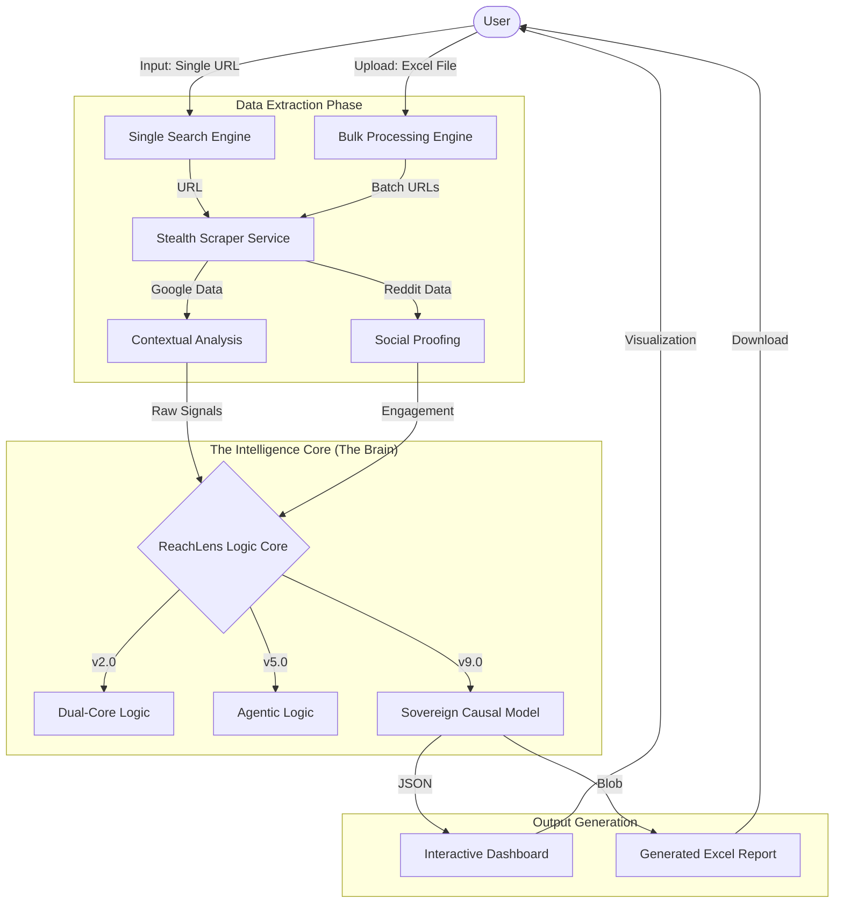
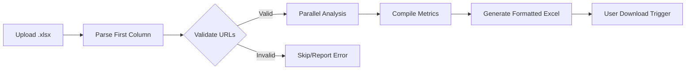

# 🦅 ReachLens: Agentic Intelligence Engine (Single + Bulk)

   

**ReachLens** is a sophisticated analytics platform designed to measure true digital influence. This version supports both **Single URL Analysis** and **Bulk Excel Processing**, allowing for high-scale media impact tracking.

🚀 **Live Demo**: [https://reachlens-analytics-fixed.vercel.app](https://reachlens-analytics-fixed.vercel.app)

---

## 🏗️ System Architecture & Flow

### 1. High-Level Logic Flow
ReachLens operates on a multi-stage intelligence pipeline that transforms raw URLs into actionable metrics.



### 2. Bulk Analysis Workflow
The bulk feature follows a strictly sequential and secure processing path.



---

## 🔮 Core Features

### 🏢 Single Article Analysis
*   **Real-time Scraping**: Evasion of bot detection to get fresh data.
*   **Multi-Platform Dorking**: Correlating Google mentions with Reddit discussions.
*   **Version Toggling**: Switch between 8+ mathematical models (v2.0 to v9.0).

### 📊 Bulk Processing (New!)
*   **Excel Integration**: Upload your media lists directly.
*   **Standardized Metrics**: Every URL in your sheet gets the same high-fidelity analysis.
*   **No Auto-Download**: Full control—download the report only when you are ready.
*   **Clean Output**: Reports are perfectly formatted with commas and headers matching the dashboard.

---

## 📁 Analysis Metrics Explained

| Metric | Description |
| :--- | :--- |
| **Total Mentions** | The raw sum of indexed mentions across Google and Social. |
| **Agentic Rank** | Identifies if content is cited by AI Agents (ChatGPT, Perplexity). |
| **Estimated Reach** | Causal AI prediction of total human impressions. |
| **Truth Confidence** | The statistical certainty of the reach number (up to 99.2%). |
| **UVR (Unique Reach)** | Deduplicated audience size (Real Unique Humans). |
| **Social Diffusion** | Shannon Entropy score measuring how organically content spreads. |
| **Growth Velocity** | The momentum of the content's spread in the last 24-48h. |

---

## 🚀 Quick Start Guide

### 1. Installation
```bash
# Clone the repository
# git clone https://github.com/developermavericks/Reach_lens.git

# Install Everything
npm install

# Build Frontend
cd client
npm run build
```

### 2. Running the Engine
**Terminal 1 (Backend):**
```bash
cd server
npm start
# Server runs on http://localhost:2000
```

**Terminal 2 (Frontend):**
```bash
cd client
npm run dev
# Dashboard opens at http://localhost:5173
```

---

## 📝 Developer Notes
*   **Excel Requirements**: Ensure your URLs are in the **first column** of the `.xlsx` file.
*   **Stateless**: This version is optimized for cloud deployment and does not require a persistent local database.
*   **Math Tuning**: To adjust the reach formulas, see `server/src/services/ReachEstimator.ts`.

---
*Built with ❤️ by the Tech Team | 2026*
